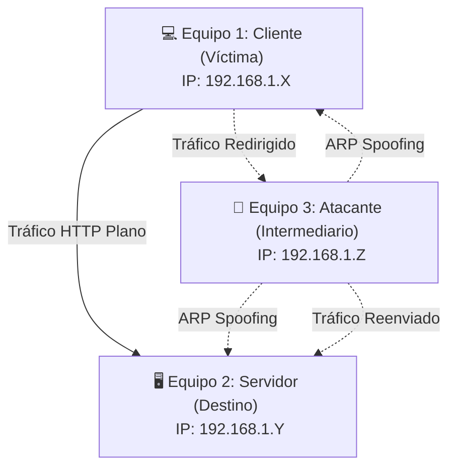

# Laboratorio de Ciberseguridad: ARP Spoofing (MitM) en Ambiente Controlado

Este proyecto contiene el código y la guía didáctica necesarios para desplegar un laboratorio de **ARP Spoofing e intercepción Man-in-the-Middle (MitM)** en un entorno seguro y controlado de 3 máquinas.

---

## 🎯 Objetivos de la Práctica
1. Comprender el funcionamiento a nivel de protocolo de ARP y su falta inherente de autenticación.
2. Analizar cómo un ataque de ARP Spoofing desvía el tráfico de red en texto plano a través de un intermediario.
3. Observar la diferencia de seguridad al transmitir credenciales en texto plano (HTTP) vs. canales cifrados (HTTPS).
4. Aprender a mitigar y defender redes frente a ataques de envenenamiento ARP.

---

## 📐 Arquitectura del Laboratorio

El laboratorio consta de tres roles conectados en el mismo segmento de red física o virtual:



1. **Equipo 1: El Cliente (Víctima)**
   - **Rol:** Envía peticiones constantes al servidor para simular tráfico web real.
   - **Ubicación:** Carpeta `equipo_cliente/` (Ejecuta `cliente.py`).
2. **Equipo 2: El Servidor (Destino)**
   - **Rol:** Aloja un sitio web básico por HTTP en texto plano (puerto 80).
   - **Ubicación:** Carpeta `equipo_servidor/` (Sirve `index.html`).
3. **Equipo 3: El Atacante (Intermediario)**
   - **Rol:** Envenena las tablas ARP de la víctima y del servidor. Intercepta y analiza el tráfico HTTP en tiempo real desde un dashboard premium interactivo.
   - **Ubicación:** Carpeta `Equipo3/` (Ejecuta `web_app.py`).

---

## 🚀 Guía de Despliegue Paso a Paso

Sigue esta guía secuencial para desplegar y probar todo el laboratorio de manera controlada:

### Fase 1: Identificación y Registro de IPs

Antes de comenzar, debes identificar la dirección IP local de cada equipo participante ejecutando el comando `ip a` (en Linux/macOS) o `ipconfig` (en Windows).

* **Equipo 1 (Cliente):** Anota su IP (ej: `192.168.1.10`)
* **Equipo 2 (Servidor):** Anota su IP (ej: `192.168.1.20`)
* **Equipo 3 (Atacante):** Anota su IP (ej: `192.168.1.30`) y el nombre de su interfaz de red activa (ej: `eth0` o `wlan0`).

---

### Fase 2: Configuración del Servidor (Equipo 2)

El servidor alojará una web simple de pruebas en texto plano (puerto 80).

1. Abre una terminal en la máquina del **Equipo 2** y navega al directorio del servidor:
   ```bash
   cd equipo_servidor
   ```
2. Inicia el servidor HTTP de Python en el puerto 80 (requiere privilegios de administrador `sudo` para escuchar en puertos bajos):
   ```bash
   sudo python3 -m http.server 80
   ```
3. El servidor quedará en espera de conexiones entrantes.

---

### Fase 3: Configuración y Ejecución del Cliente (Equipo 1)

El cliente automatiza peticiones HTTP cada 3 segundos hacia el servidor para simular tráfico de red continuo.

1. Abre una terminal en la máquina del **Equipo 1** y navega al directorio del cliente:
   ```bash
   cd equipo_cliente
   ```
2. Ejecuta el script pasándole la IP del servidor que registraste en la Fase 1:
   ```bash
   python3 cliente.py <IP_DEL_SERVIDOR>
   ```
   *(Ejemplo: `python3 cliente.py 192.168.1.20`)*
   
3. Verás en pantalla las peticiones exitosas consecutivas:
   ```text
   [+] [0001] Petición exitosa! Código: 200 | Latencia: 12.45ms
   [+] [0002] Petición exitosa! Código: 200 | Latencia: 10.12ms
   ```

---

### Fase 4: Ejecución de la Interfaz del Atacante (Equipo 3)

El atacante levantará una consola web interactiva premium para orquestar los comandos del sistema y ver el tráfico en vivo.

1. Abre una terminal en la máquina del **Equipo 3** y navega al directorio del atacante:
   ```bash
   cd Equipo3
   ```
2. Asegúrate de instalar las herramientas del sistema y los requerimientos necesarios:
   ```bash
   # Dependencias de red Linux
   sudo apt update
   sudo apt install dsniff tcpdump -y
   
   # Dependencias de Python
   pip install -r requirements.txt
   ```
3. Inicia la aplicación web con privilegios administrativos (`sudo`):
   ```bash
   sudo python3 web_app.py
   ```
4. Abre un navegador web e ingresa a: `http://localhost:8080` (o desde la red con `http://<IP_DEL_ATACANTE>:8080`).
5. En el panel lateral de **Configuración**:
   - Selecciona la **Interfaz de red** recomendada.
   - Introduce la **IP Víctima (Equipo 1)**.
   - Introduce la **IP Servidor (Equipo 2)**.
6. Haz clic en **INICIAR ATAQUE**.

---

## 🔍 Fase 5: Análisis y Observación durante el Ataque

Una vez activo el ataque, la interfaz web del Equipo 3 actuará como un centro de control operativo (SOC):

1. **Monitoreo en Tiempo Real:** Las peticiones `GET` y respuestas HTTP que viajan entre la víctima y el servidor se reflejarán instantáneamente en la terminal interactiva.
2. **Alertas de Credenciales:** Si simulas la captura de contraseñas u otros datos clave, la métrica de **Credenciales Capturadas** se iluminará con una alarma en rojo neón y los logs correspondientes se destacarán con la etiqueta `🔑 ¡CREDENCIAL DETECTADA!`.
3. **Filtros de Consola:** Utiliza las pestañas de la consola para filtrar rápidamente entre `GET`, `POST` y `Credenciales` para analizar paquetes específicos.

---

## 🛑 Fase 6: Finalización y Limpieza

1. En el panel web del atacante, haz clic en **DETENER ATAQUE**.
   - El sistema automáticamente detendrá los subprocesos de `arpspoof` y `tcpdump`.
   - Restablecerá la configuración del sistema `net.ipv4.ip_forward=0` para detener la desviación.
2. Haz clic en **LIMPIAR CACHÉ ARP** para purgar las tablas ARP envenenadas del host local.
3. Detén los scripts simuladores en las terminales del Cliente y Servidor presionando `Ctrl + C`.

---

## 🔒 Medidas de Mitigación y Defensa

Este laboratorio demuestra los riesgos críticos de la transmisión de datos sin cifrar en redes locales. En un entorno de producción real, las medidas de defensa recomendadas son:

1. **Implementar HTTPS (TLS/SSL):** Cifra los datos en tránsito para que, aunque el atacante intercepte los paquetes con ARP Spoofing, solo observe cadenas de bytes cifrados ilegibles.
2. **Inspección ARP Dinámica (DAI):** Configuración nativa en switches administrables que valida y bloquea tramas ARP sospechosas que no correspondan con la base de datos confiable de asignaciones IP-MAC.
3. **Tablas ARP Estáticas:** Para sistemas y enrutadores críticos de infraestructura, configurar manualmente y de forma fija las direcciones MAC asociadas a las IPs clave para evitar alteraciones dinámicas.
