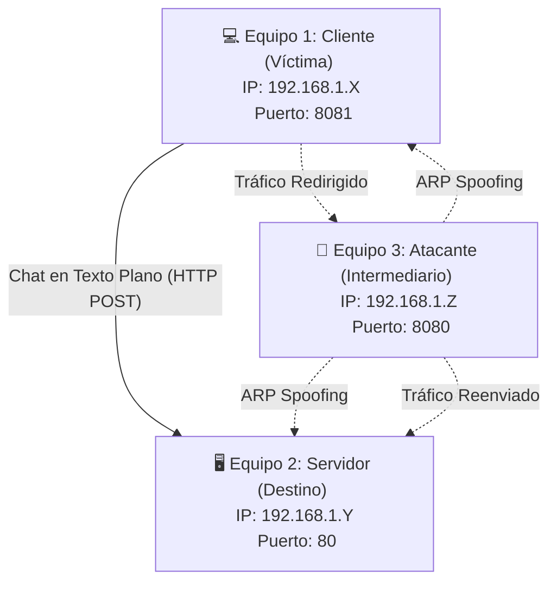

# Laboratorio de Ciberseguridad: ARP Spoofing (MitM) con Mensajería Interactiva

Este proyecto contiene el código y la guía didáctica necesarios para desplegar un laboratorio avanzado de **ARP Spoofing e intercepción Man-in-the-Middle (MitM)** en un entorno seguro y controlado de 3 máquinas.

A diferencia de un laboratorio estático, esta práctica incluye un **sistema de chat interactivo bidireccional no cifrado (HTTP)** que permite visualizar en tiempo real cómo un atacante intercepta y se apodera de conversaciones privadas en la red local.

---

## 🎯 Objetivos de la Práctica
1. Comprender el funcionamiento a nivel de protocolo de ARP y su falta inherente de autenticación.
2. Analizar cómo un ataque de ARP Spoofing desvía el tráfico de red en texto plano a través de un intermediario.
3. Observar la interceptación y lectura en texto claro de mensajes interactivos transmitidos por HTTP en el puerto 80.
4. Aprender a mitigar y defender redes frente a ataques de envenenamiento ARP.

---

## 📐 Arquitectura del Laboratorio

El laboratorio consta de tres roles conectados en el mismo segmento de red física o virtual:



1. **Equipo 1: El Cliente (Víctima)**
   - **Rol:** Ejecuta un chat web local para configurar la IP del servidor y enviar mensajes confidenciales sin cifrar.
   - **Ubicación:** Carpeta `equipo_cliente/` (Ejecuta `client_app.py` en puerto `8081`).
2. **Equipo 2: El Servidor (Destino)**
   - **Rol:** Hospeda el servidor de chat central en el puerto estándar HTTP (80) para recibir las peticiones de la víctima y responderle.
   - **Ubicación:** Carpeta `equipo_servidor/` (Ejecuta `server_app.py` en puerto `80`).
3. **Equipo 3: El Atacante (Intermediario)**
   - **Rol:** Envenena las tablas ARP de ambos extremos y utiliza su panel de monitoreo premium para capturar y mostrar de forma destacada las conversaciones secretas en tiempo real.
   - **Ubicación:** Carpeta `Equipo3/` (Ejecuta `web_app.py` en puerto `8080`).

---

## 🚀 Guía de Despliegue Paso a Paso

Sigue esta guía secuencial para desplegar y probar el laboratorio interactivo:

### Fase 1: Identificación y Registro de IPs

Antes de comenzar, debes identificar la dirección IP local de cada equipo participante ejecutando el comando `ip a` (en Linux/macOS) o `ipconfig` (en Windows).

* **Equipo 1 (Cliente):** Anota su IP (ej: `192.168.1.10`)
* **Equipo 2 (Servidor):** Anota su IP (ej: `192.168.1.20`)
* **Equipo 3 (Atacante):** Anota su IP (ej: `192.168.1.30`) y el nombre de su interfaz de red activa (ej: `eth0` o `wlan0`).

---

### Fase 2: Configuración del Servidor de Chat (Equipo 2)

El servidor central recibirá los mensajes del cliente a través de HTTP estándar.

1. Abre una terminal en la máquina del **Equipo 2** y navega a su directorio:
   ```bash
   cd equipo_servidor
   ```
2. Instala dependencias necesarias (`Flask`):
   ```bash
   pip install Flask
   ```
3. Inicia la aplicación de chat del servidor con privilegios administrativos (`sudo` es obligatorio para abrir el puerto 80):
   ```bash
   sudo python3 server_app.py
   ```
4. Abre tu navegador e ingresa a `http://localhost`. Verás la interfaz de mensajería del servidor esperando conexiones.

---

### Fase 3: Configuración del Cliente de Chat (Equipo 1)

El cliente dispondrá de un panel para interactuar y enviar mensajes confidenciales.

1. Abre una terminal en la máquina del **Equipo 1** y navega a su directorio:
   ```bash
   cd equipo_cliente
   ```
2. Instala dependencias necesarias (`Flask`):
   ```bash
   pip install Flask
   ```
3. Inicia la aplicación de chat del cliente:
   ```bash
   python3 client_app.py
   ```
4. Abre tu navegador e ingresa a `http://localhost:8081`.
5. En el panel izquierdo de la interfaz, introduce la **IP del Servidor (Equipo 2)** que registraste en la Fase 1 y haz clic en **Establecer**. La sala de chat quedará vinculada.

---

### Fase 4: Ejecución del Dashboard del Atacante (Equipo 3)

El atacante envenenará la red e interceptará activamente las tramas de datos del chat.

1. Abre una terminal en la máquina del **Equipo 3** y navega a su directorio:
   ```bash
   cd Equipo3
   ```
2. Asegúrate de instalar las herramientas del sistema y las librerías de Python:
   ```bash
   # Dependencias de red del sistema
   sudo apt update
   sudo apt install dsniff tcpdump -y
   
   # Dependencias de Python
   pip install -r requirements.txt
   ```
3. Inicia el panel web de control con privilegios administrativos (`sudo`):
   ```bash
   sudo python3 web_app.py
   ```
4. Abre tu navegador e ingresa a `http://localhost:8080`.
5. Configura los campos del ataque:
   - Selecciona la **Interfaz de red** activa.
   - Introduce la **IP Víctima (Equipo 1)**.
   - Introduce la **IP Servidor (Equipo 2)**.
6. Haz clic en el botón verde **INICIAR ATAQUE**. El panel cambiará a **MONITOREANDO RED (MitM)**.

---

## 🔍 Fase 5: Simulación e Intercepción de Mensajes en Vivo

Con el ataque activo, simula una comunicación confidencial:

1. **Envío de Mensajes:** 
   - Ve a la interfaz del **Cliente** (`http://localhost:8081`) e introduce un mensaje comprometedor en el chat (ejemplo: *"Hola, la clave secreta de acceso de la base de datos es: DbAdmin2026!"*). Haz clic en enviar.
   - Ve a la interfaz del **Servidor** (`http://localhost`). Verás que el mensaje ha llegado de forma normal e inmediata. Responde desde el servidor: *"Entendido, recibido. Guardando clave"*.
2. **Visualización en el Atacante:**
   - Abre el dashboard del **Atacante** (`http://localhost:8080`).
   - Verás que en la consola de tráfico interceptado han aparecido de forma inmediata alertas destacadas en púrpura neón con la etiqueta:
     `💬 CHAT INTERCEPTADO: [CLIENTE] 💬 Hola, la clave secreta...`
     `💬 CHAT INTERCEPTADO: [SERVIDOR] 💬 Entendido, recibido...`
   - Haz clic en la pestaña **Chat Interceptado** de la consola para aislar y reconstruir la conversación completa de forma limpia y ordenada.

---

## 🛑 Fase 6: Finalización y Limpieza

1. En el panel del atacante, haz clic en **DETENER ATAQUE** para matar de forma segura los procesos de envenenamiento y apagar el reenvío de IP.
2. Haz clic en **LIMPIAR CACHÉ ARP** para purgar el direccionamiento del host local.
3. Detén las consolas de ejecución presionando `Ctrl + C` en cada una de las terminales de los equipos.

---

## 🔒 Medidas de Mitigación y Defensa

Este laboratorio evidencia de forma práctica que las transmisiones de chat y credenciales sin cifrar a través de HTTP son completamente vulnerables en redes locales:

1. **Cifrado TLS/SSL (HTTPS/WSS):** El uso de certificados seguros encripta el contenido del chat en la capa de transporte. Aunque el atacante intercepte los paquetes con ARP Spoofing, solo capturará tramas binarias ilegibles.
2. **Dynamic ARP Inspection (DAI):** Medida en switches administrables que valida y descarta respuestas ARP sospechosas comparándolas con asignaciones confiables de IP-MAC.
3. **Tablas ARP Estáticas:** Fijar manualmente la MAC de los hosts críticos e interfaces de salida (gateways) para ignorar solicitudes y respuestas ARP no autorizadas.
